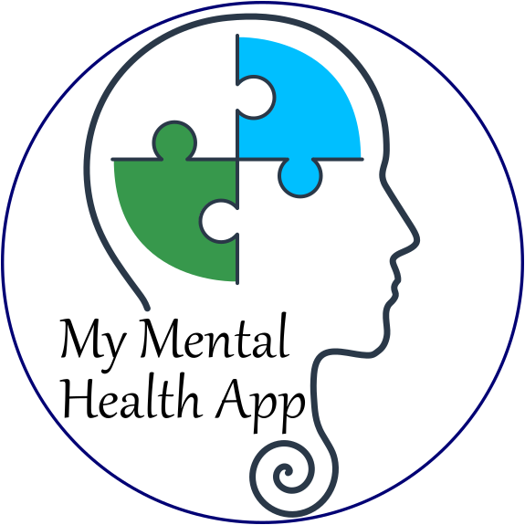

# My Mental Health App

**My Mental Health App** is an android app, intended to help users track their mental health between
therapy sessions.

This project was created in 2022.
To run it, you will need to update it and its dependencies.
It cannot run without further updates.

The project was created using:

* openJDK11
* SDK 32
* gradle 7.2.1
* Android 11.

